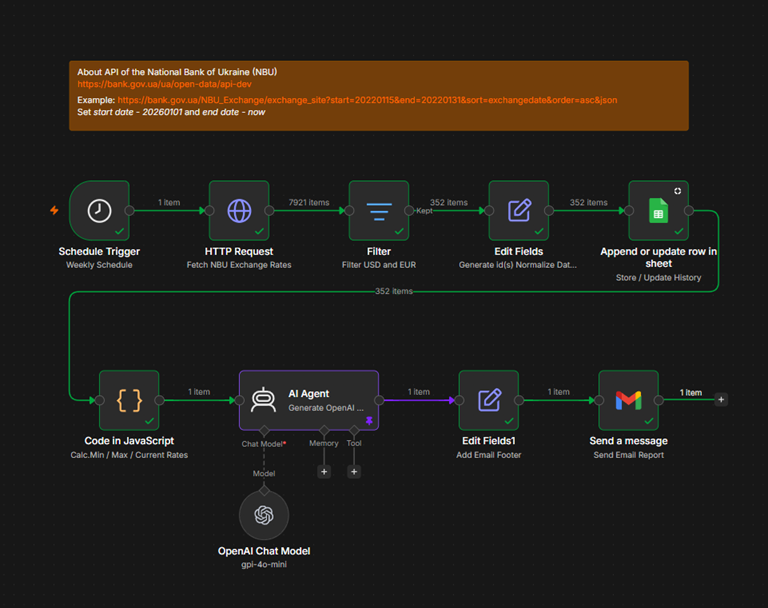

# Exchange Rate Monitoring & Reporting Pipeline

Automated exchange rate monitoring and reporting workflow built with n8n.

This project retrieves historical exchange rate data from the National Bank of Ukraine (NBU) Open Data API, stores exchange rate history in Google Sheets, calculates exchange rate statistics, generates AI-powered summaries using OpenAI GPT-4o-mini, and delivers scheduled email reports.

---

## Table of Contents

- [Overview](#overview)
- [Features](#features)
- [Workflow](#workflow)
- [Workflow Architecture](#workflow-architecture)
- [Technologies](#technologies)
- [Prerequisites](#prerequisites)
- [Setup Instructions](#setup-instructions)
- [Data Source](#data-source)
- [Historical Data Storage](#historical-data-storage)
- [Workflow Steps](#workflow-steps)
- [Repository Structure](#repository-structure)
- [Security Notes](#security-notes)
- [Skills Demonstrated](#skills-demonstrated)
- [Future Improvements](#future-improvements)
- [Project Outcomes](project-outcomes)

---

## Overview

The workflow automates the complete exchange rate reporting process.

Exchange rate data is retrieved from the National Bank of Ukraine Open Data API, transformed into a standardized structure, stored in Google Sheets, analyzed using JavaScript, summarized using OpenAI GPT-4o-mini, and distributed automatically via email.

The workflow continuously maintains a historical exchange rate dataset and generates periodic analytical reports.

For each monitored currency, the workflow calculates:

- Current exchange rate
- Minimum exchange rate and occurrence date
- Maximum exchange rate and occurrence date

---

## Features

- Scheduled workflow execution
- NBU Open Data API integration
- Historical exchange rate tracking
- Google Sheets storage
- Date normalization
- Historical record sorting
- Duplicate prevention
- Append-or-update storage strategy
- JavaScript analytics
- OpenAI-powered summaries
- Automated email notifications
- Workflow automation with n8n

---

## Workflow



---

## Workflow Architecture

```text
Schedule Trigger
      │
      ▼
HTTP Request
      │
      ▼
Filter (USD, EUR)
      │
      ▼
Edit Fields
(Generate Record ID + Normalize Date)
      │
      ▼
Sort Historical Records
      │
      ▼
Google Sheets
(Append or Update)
      │
      ▼
JavaScript Analytics
      │
      ▼
OpenAI Summary Generation
      │
      ▼
Email Formatting
      │
      ▼
Gmail Notification
```

---

## Technologies

- n8n
- JavaScript
- OpenAI GPT-4o-mini
- Google Sheets
- Gmail
- REST API
- HTTP Request

---

## Prerequisites

Before running the workflow, prepare:

- n8n instance
- OpenAI API access
- Google account
- Gmail OAuth2 credentials
- Google Sheets OAuth2 credentials

---

## Setup Instructions

### 1. Create a Google Sheet

Create a spreadsheet for storing exchange rate history.

Suggested structure:

| id | exchange_date | currency | currency_short | rate |
|------|------|------|------|------|

### 2. Configure Google Sheets Credentials

Create a Google Sheets OAuth2 credential in n8n and connect it to your spreadsheet.

### 3. Configure Gmail Credentials

Create a Gmail OAuth2 credential in n8n.

### 4. Configure OpenAI Credentials

Create an OpenAI credential and connect it to the OpenAI node.

### 5. Import the Workflow

Import the workflow JSON file into n8n.

### 6. Update Configuration

Review and update:

- Spreadsheet selection
- Email recipients
- Credentials
- Schedule settings

### 7. Test the Workflow

Verify that:

- Exchange rates are retrieved successfully
- Records are written to Google Sheets
- Existing records are updated correctly
- Statistics are calculated correctly
- OpenAI summary is generated
- Email delivery succeeds

### 8. Activate the Workflow

Enable the workflow and configure the desired schedule.

Example:

```text
Every Monday
08:00 AM
```

---

## Data Source

Exchange rate data is retrieved from the National Bank of Ukraine Open Data API.

Currencies currently monitored:

- USD (US Dollar)
- EUR (Euro)

---

## Historical Data Storage

Exchange rate history is stored in a Google Sheet named:

**Exchange_Rate_History**

### Data Model

| Field | Type |
|---------|---------|
| id | String |
| exchange_date | Date |
| currency | String |
| currency_short | String |
| rate | Number |

### Unique Identifier

```text
USD_24.06.2026
EUR_24.06.2026
```

The unique identifier allows the workflow to update existing records and append new records without creating duplicates.

---

## Workflow Steps

### 1. Data Collection

Retrieve exchange rate data from the NBU Open Data API.

### 2. Currency Filtering

Keep only target currencies:

- USD
- EUR

### 3. Record Preparation

Generate unique IDs and normalize date values.

### 4. Historical Record Sorting

Records are sorted chronologically before storage.

Sorting is not required for duplicate prevention, since updates rely on the unique ID field. However, sorting keeps the spreadsheet organized and easier to review manually.

### 5. Historical Data Storage

Store records using the Append or Update strategy.

### 6. Statistical Analysis

Calculate:

- Current exchange rate
- Current exchange rate date
- Minimum exchange rate
- Date of minimum exchange rate
- Maximum exchange rate
- Date of maximum exchange rate

### 7. OpenAI Summary Generation

Generate a concise business-style exchange rate report using OpenAI GPT-4o-mini.

### 8. Email Formatting

Append static content, report links, and footer information.

### 9. Email Delivery

Send the final report automatically via Gmail.

---

## Repository Structure

```text
.
├── README.md
├── workflow
│   └── exchange_rate_reporting.json
└── Images
    ├── workflow.png
    └── email_example.png
```

---

## Security Notes

Sensitive information has been removed from this repository.

The workflow does not contain:

- API keys
- OAuth tokens
- OpenAI credentials
- Gmail credentials
- Google account information
- Spreadsheet IDs
- Email addresses

To reproduce this project, create your own credentials and storage resources.

---

## Skills Demonstrated

- Workflow Automation
- REST API Integration
- Data Collection
- Historical Data Management
- Data Transformation
- Data Normalization
- Data Deduplication
- JavaScript Data Processing
- Google Sheets Automation
- OpenAI Integration
- Automated Reporting
- ETL Pipeline Design


## Project Outcomes

This project demonstrates how n8n can be used to automate a complete reporting workflow, from data collection to report delivery.

The solution integrates external API data, maintains historical records, performs automated calculations, generates AI-powered summaries, and distributes reports without manual intervention.

By combining workflow automation, data processing, cloud storage, AI-powered reporting, and scheduled email delivery, the project showcases a practical end-to-end automation solution applicable to financial monitoring and business reporting scenarios.

Key capabilities demonstrated include:

Building production-style n8n workflows
Integrating third-party APIs
Managing historical datasets
Implementing deduplication strategies
Processing data with JavaScript
Using AI for business reporting
Automating recurring reporting tasks
